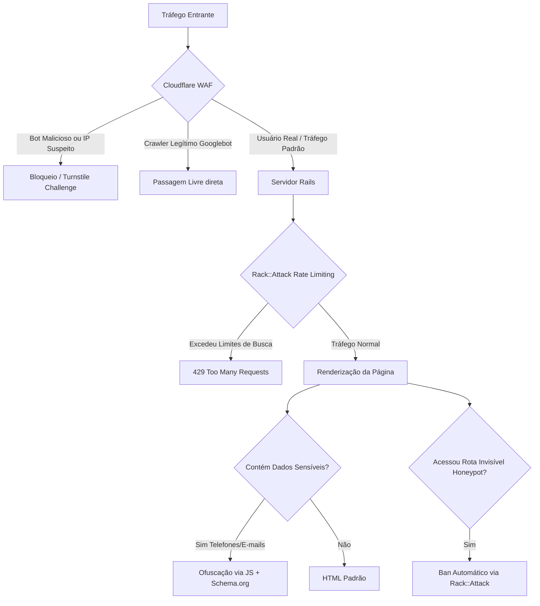

# Plano de Proteção contra Scraping (Anti-Scraping & SEO-Friendly)

Este plano detalha as estratégias, arquitetura técnica e passos de implementação para proteger a base de 1.4 milhões de empresas contra scrapers automatizados, garantindo ao mesmo tempo que o **Googlebot** e outros indexadores legítimos continuem indexando as páginas sem bloqueios.

---

## 1. Arquitetura de Defesa Multicamadas

A estratégia de segurança combina proteção na borda (DNS/WAF), limite de requisições na aplicação, armadilhas estruturais (honeypots) e ofuscação inteligente dos dados mais valiosos.



---

## 2. Especificação Técnica das Medidas

### A. Integração com Cloudflare (Camada 1 - Borda)
*   **Ação:** Apontar o DNS do domínio para o Cloudflare.
*   **Regras Básicas:**
    *   Ativar o **Bot Fight Mode** básico no plano gratuito.
    *   Configurar regras de WAF para desafiar (Challenge) requisições com User-Agents vazios, obsoletos ou de bibliotecas de requisição direta (ex: `Python-urllib`, `Go-http-client`).
    *   **Whitelist automática:** O Cloudflare valida o tráfego do Googlebot por meio de DNS reverso e assinaturas criptográficas, garantindo passagem livre automática.

### B. Limitação de Requisições com `Rack::Attack` (Camada 2 - Rails Middleware)
Adicionar a gem `rack-attack` para evitar que bots consumam os recursos do banco de dados SQLite com buscas infinitas.

*   **Instalação (`Gemfile`):**
    ```ruby
    gem "rack-attack"
    ```
*   **Configuração (`config/initializers/rack_attack.rb`):**
    *   **Throttling das buscas:** Limitar o endpoint `/busca` a no máximo 30 requisições por minuto por IP.
    *   **Throttling de visualização de páginas:** Limitar o acesso a `/empresa/*` ou páginas de cidades/bairros a no máximo 60 requisições por minuto por IP.
    *   **Verificação de Bots Legítimos (Whitelist):**
        ```ruby
        # Evita limitar bots de busca legítimos validados pelo Cloudflare
        # (Cloudflare envia o cabeçalho 'Cf-Verified-Bot' como 'true' para crawlers validados)
        Rack::Attack.safelist('allow-verified-bots') do |req|
          req.env['HTTP_CF_VERIFIED_BOT'] == 'true'
        end
        ```

### C. Armadilha Invisível (Honeypot) (Camada 3 - Aplicação)
Criar links ocultos que apenas robôs (que analisam o HTML bruto sem executar CSS) tentarão ler e seguir.

1.  **Regra no `public/robots.txt`:**
    ```text
    User-agent: *
    Disallow: /admin/system_diagnostic
    ```
    *Dica:* Os bots legítimos respeitam o `robots.txt` e ignoram o link. Scrapers maliciosos ignoram o arquivo de regras e clicam no link.
2.  **Link no layout do rodapé (`app/views/layouts/application.html.erb`):**
    ```html
    <a href="/admin/system_diagnostic" class="hidden-honeypot" style="position: absolute; left: -9999px; width: 1px; height: 1px; overflow: hidden;" tabindex="-1" aria-hidden="true">
      Diagnóstico do Sistema
    </a>
    ```
3.  **Bloqueio Automático no Rails:**
    Se qualquer IP tentar bater na rota `/admin/system_diagnostic`, o `Rack::Attack` adiciona o IP em uma lista de bloqueio permanente (`bantime = 1.week`).

### D. Ofuscação de Contatos e Preservação de SEO (Camada 4 - Frontend/UI)
Telefones e e-mails são os maiores alvos de scrapers. Devemos protegê-los sem sumir com as informações para o Googlebot.

1.  **HTML Estruturado para o Google (SEO):**
    Mantemos os telefones legíveis no JSON-LD (Schema.org) injetado no cabeçalho das páginas das empresas. O Googlebot lê isso e indexa o contato do estabelecimento.
2.  **Ofuscação no Frontend (Base64 + JS):**
    *   Na view, renderizamos o telefone codificado em Base64:
        ```html
        <div data-controller="obfuscator" 
             data-obfuscator-phone-value="<%= Base64.strict_encode64(@company.phone_1) %>"
             class="phone-placeholder">
          <span>(Clique para ver)</span>
        </div>
        ```
    *   Um controller Stimulus decodifica o telefone e o exibe de duas formas possíveis:
        *   **On-Load (Recomendado para manter UX simples):** Ao carregar a página, o JavaScript decodifica e mostra o telefone. Robôs de terminal não rodam JS e leem apenas o Base64 inútil. O Googlebot moderno roda JS e verá o número.
        *   **On-Click (Mais seguro, mas não indexável):** O telefone só é decodificado quando o usuário clica no placeholder.

---

## 3. Cronograma de Implementação (Passo a Passo)

| Etapa | Tarefa | Responsabilidade | Status |
| :--- | :--- | :--- | :---: |
| **Passo 1** | Configurar o domínio no Cloudflare (DNS) | Infra / DNS | 📅 A Fazer |
| **Passo 2** | Ativar o "Bot Fight Mode" e "Turnstile" no Cloudflare | Infra / WAF | 📅 A Fazer |
| **Passo 3** | Instalar a gem `rack-attack` e configurar limites iniciais | Backend | 📅 A Fazer |
| **Passo 4** | Adicionar whitelist para `Cf-Verified-Bot` no Rails | Backend | 📅 A Fazer |
| **Passo 5** | Criar a rota Honeypot e configurar regras de bloqueio | Backend | 📅 A Fazer |
| **Passo 6** | Atualizar `robots.txt` para proteger a rota honeypot | Backend | 📅 A Fazer |
| **Passo 7** | Criar controller Stimulus para decodificar contatos na tela | Frontend | 📅 A Fazer |
